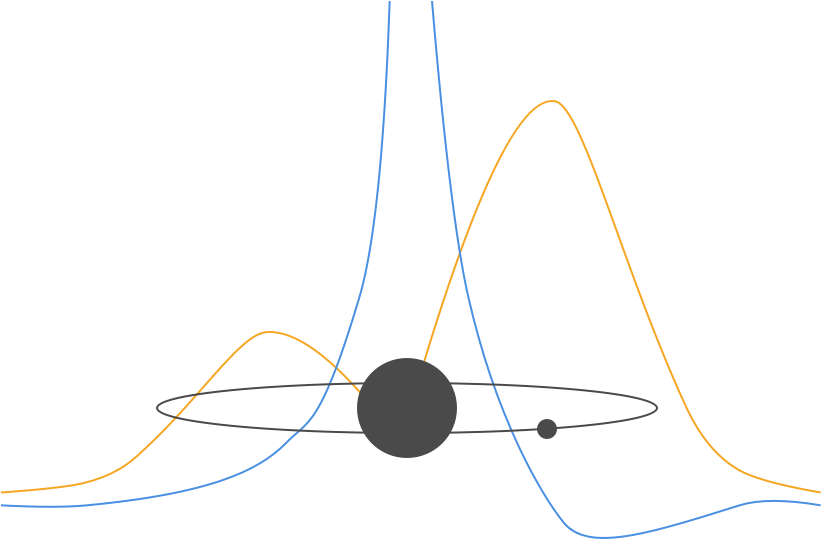

# Exploring the Universe Through Hydrogen: A Beginners Guide to Physics
 
# Table of Contents 

- [Chapter 00: Introduction](#Chapter-00)  
- [Chapter 01: How do we map the Universe?](#Chapter-01)  
- [Chapter 02: Who mapped out the particles in the Universe?](#Chapter-02)  
- [Chapter 03: What is hydrogen?](#Chapter-03)  
- [Chapter 04:](#Chapter-04)  
- [Chapter 05:](#Chapter-05)  
- [Chapter 06: How long does the classical model of physics predict a hydrogen atom should exist?](#Chapter-06)  
- [Chapter 07: How long does a hydrogen atom exist?](#Chapter-07)  
- [Chapter 08: How do we radically change the nature of physics to reconcile this?](#Chapter-08)  
- [Chapter 09:](#Chapter-09)  
- [Chapter 10:](#Chapter-10)  
- [Chapter 11: How do you solve an atom?](#Chapter-11)  
- [Chapter 12: Is there an element simpler than Hydrogen?](#Chapter-12)  
- [Chapter 13:](#Chapter-13)  
- [Chapter 14: Why?](#Chapter-14)  

#### Chapter 00
## Introduction
...

#### Chapter 01
## How do we map the Universe?
I know there is a classroom below the library in the Physics building at the University of Rochester. I have heard footsteps above me during lectures and the respective room numbers are the same apart from the first digit. To really test my prediction, I would need a jackhammer and a lack of empathy for the building maintenance staff.

#### Chapter 02
## Who mapped out the particles in the Universe?
...

#### Chapter 03
## What is hydrogen?
...

#### Chapter 04
##
...

#### Chapter 05
##
...

#### Chapter 06
## How long does the classical model of physics predict a hydrogen atom should exist?
...

#### Chapter 07
## How long does a hydrogen atom exist?
...

#### Chapter 08
## How do we radically change the nature of physics to reconcile this?
...

#### Chapter 09
##
...

#### Chapter 10
##
...

#### Chapter 11
## How do you solve an atom?
...

#### Chapter 12
## Is there an element simpler than Hydrogen?
...

#### Chapter 13
##
...

#### Chapter 14
## Why?
...